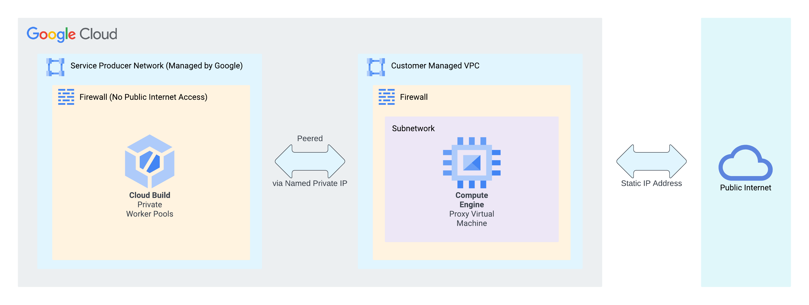

## Configuring Cloud Build to use Static External IP Addresses

### High Level Overview


### Provisioning Infrastructures
Make sure you have [Terraform](https://developer.hashicorp.com/terraform/downloads) and [gcloud CLI](https://cloud.google.com/sdk/docs/install) installed on your machine and authenticated to your Google Cloud Project.

Then Populate variables inside `variables.auto.tfvars` and run:

```
terraform init
terraform validate
terraform plan -out tfplan
terraform apply "tfplan"
```

### Running a sample Build
```
gcloud builds submit --no-source --config=build.yml
```
When this command finishes execution, You will see the IP address of the Proxy Server printed at the end which indicates that the outside world thinks Cloud Build Instances have that IP address.